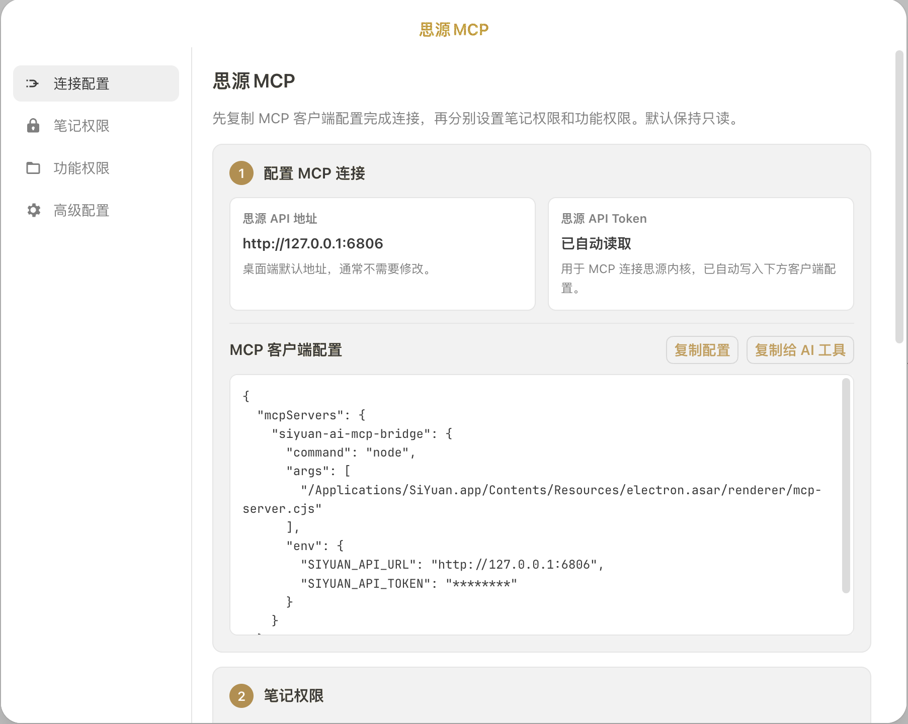
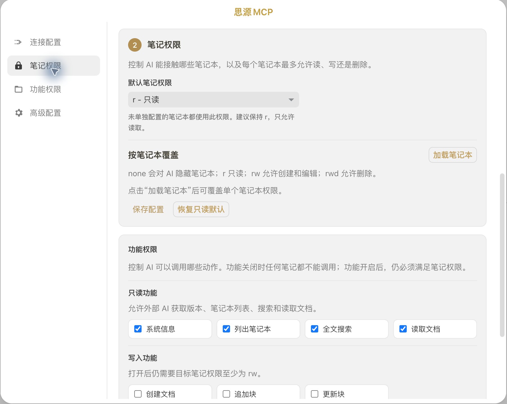

# 思源MCP

让支持 MCP 的 AI 工具在授权范围内读取、搜索和整理你的思源笔记。

思源MCP 把思源变成一个可控的本地知识库。你可以把笔记本、文档和搜索能力交给外部 AI 使用，同时保留清晰的权限边界：默认只读，需要写入或删除时再手动开启。

## 可以怎么用

- 在 AI 工具里问：“帮我搜索最近关于 Android 面试题的笔记，并总结重点。”
- 让 AI 根据你的思源文档回答问题，而不是只依赖模型记忆。
- 让 AI 读取某个笔记本里的资料，整理成会议纪要、学习清单或待办事项。
- 在确认权限后，让 AI 把整理结果追加到指定文档。
- 对敏感笔记本设置 `none`，让 AI 完全看不到这些内容。

## 推荐使用流程

1. 在思源集市安装并启用插件。
2. 打开 `设置 -> 集市 -> 已下载 -> 插件`。
3. 点击“思源MCP”插件卡片上的齿轮按钮进入配置界面。
4. 在“连接配置”里复制 MCP 客户端配置。
5. 粘贴到 Claude、Codex、Cursor 等支持 MCP 的 AI 工具中。
6. 回到插件设置，按需要调整“笔记权限”和“功能权限”。

插件不会常驻顶栏图标，避免打扰日常写作。需要修改配置时，从集市插件卡片或命令面板打开设置即可。

## 权限怎么理解

思源MCP 有两层权限：笔记权限和功能权限。

笔记权限决定 AI 能接触哪些笔记本：

- `none`：隐藏，AI 看不到这个笔记本。
- `r`：只读，AI 可以搜索和读取。
- `rw`：读写，AI 可以创建和编辑。
- `rwd`：读写删除，AI 可以删除内容。

功能权限决定 AI 能调用哪些动作。即使打开了写入或删除工具，也仍然需要目标笔记本具备对应权限。

建议先保持默认只读：AI 可以读取和搜索，但不能创建、修改或删除内容。确认工作流稳定后，再只给少数可信笔记本开启写入权限。

## 关于 Token

插件会自动读取本机思源 API Token，并写入复制出来的 MCP 配置。这个 Token 只用于 MCP 客户端连接本机思源内核，不是 OpenAI、Claude 或其他 AI 平台的 Key。

配置界面会隐藏 Token 展示，但复制配置时会包含真实值。请不要把复制出来的配置发布到仓库、截图或公共对话中。

## English

SiYuan MCP lets MCP-compatible AI tools search, read, and organize your SiYuan notes within permissions you control.

Typical usage:

- Ask an AI tool to search your SiYuan notes and summarize the useful parts.
- Let AI answer from your own notes instead of relying only on model memory.
- Keep private notebooks hidden from AI.
- Enable write access only for trusted notebooks when you want AI to append or create notes.

Open settings from `Settings -> Bazaar -> Downloaded -> Plugins`, then click the gear button on the SiYuan MCP plugin card. The plugin does not keep a permanent top-bar icon.

Start with the default read-only mode, then enable write or delete access only for notebooks you trust.
